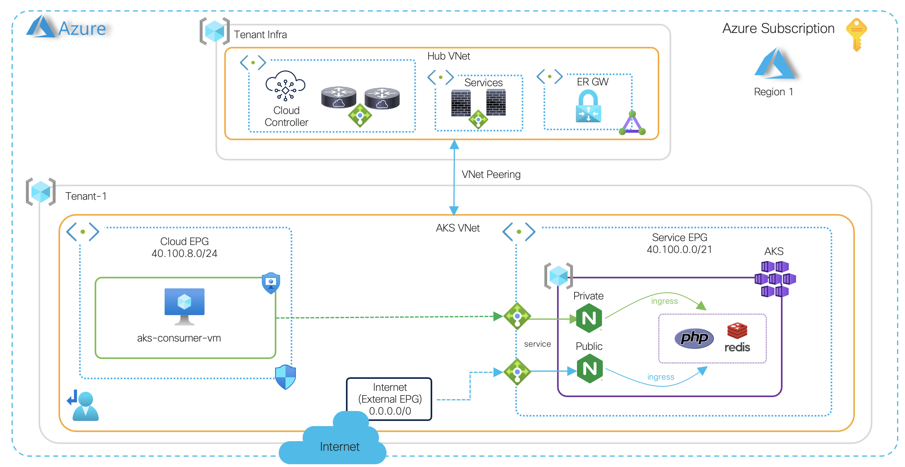

[](https://developer.cisco.com/codeexchange/github/repo/marinalf/cnc-aks-build-cloud-native-managed)
### About <a name = "about"></a>

This is a sample terraform code to automate networking and policies for AKS with the [Cloud Network Controller](https://www.cisco.com/c/en/us/solutions/data-center-virtualization/application-centric-infrastructure/cloud-network-controller.html) policy model, demonstrating how to build connectivity to native services. 

### High Level Diagram



### Prerequisites

1. CNC First Time setup completed + Tenant
2. Helm, kubectl, Azure and AKS CLI installed

```
 az aks install-cli
 az login
 az account set --subscription <aks_subscription>
```

### High Level Steps

1. Review variables to match deployment (tenant, region, subscription, credentials)
2. Deploy VNet networking for AKS **(1 - vnet-networking)**
3. Deploy VNet policies for AKS **(2 - vnet-policies)**
4. Define a Service EPG with "Cloud Native Managed" type and select AKS (+ subnet-based selector)
5. Assign the Service EPG as provider in the contract workflow for internal-access/internet-access
6. Deploy AKS **(3 - aks-build)** ==> *using minimal settings for dev/test only*
7. Assign "my-aks" service and its managed identity with Contributor role in the VNet Resource Group managed by CNC 

#### Usage

```
terraform init
terraform plan
terraform apply
```

### Verify AKS Cluster Status

Once deployed, get credentials and verify nodes are up.

```
az aks get-credentials --resource-group <rg-name> --name <aks-cluster-name> --admin
kubectl get nodes -o wide
```
### Deploy Sample App

1. Deploy guestbook app per guidelines on **(3 - aks-build/guestbook-app-sample)**

### Deploy Sample VM

1. Deploy consumer VM **(4 - internal-consumer)**